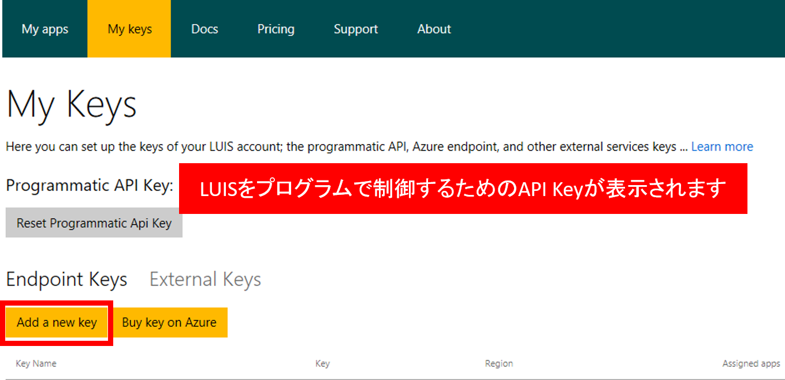

# ここで理解できること
LUIS アプリを作成する方法をマスターします

## 前提条件
- Microsoft Azure が利用できること。アカウントを持っていない方は[ここ](https://azure.microsoft.com/ja-jp/free/)から無償評価用アカウントを作成してください。
- HTTP GET を使って REST API を呼ぶことができる
- 組織アカウント(Office 365のアカウント)、もしくは、Microsoft Account

## LUISのキー作成と登録
1. [このドキュメント](https://docs.microsoft.com/ja-jp/azure/cognitive-services/LUIS/AzureIbizaSubscription)を参照してLUISのキーを作成します。
2. [LUIS](https://www.luis.ai)のページへアクセスします。
3. 右上の [Sign in]ボタンをクリック後サインインします。
4. 初回アクセスの方はウェルカム画面が表示されるので内容を確認してみてください。
5. [My Keys]をクリックします。

6. [Add a new key]をクリックしてキー登録を始めます。この画面で表示される API Keyは今回使わないので無視してください。

7. Azureで取得したLUISのキーを入力後、[Save]ボタンをクリックして保存します。

8. 完了するとキー一覧に、先ほどセットしたキーが表示されます。登録はこれで完了です。

9. 次の手順へ進むために[My apps]をクリックしておいてください。

## LUIS アプリの作成
